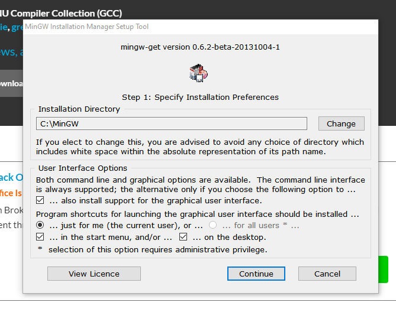
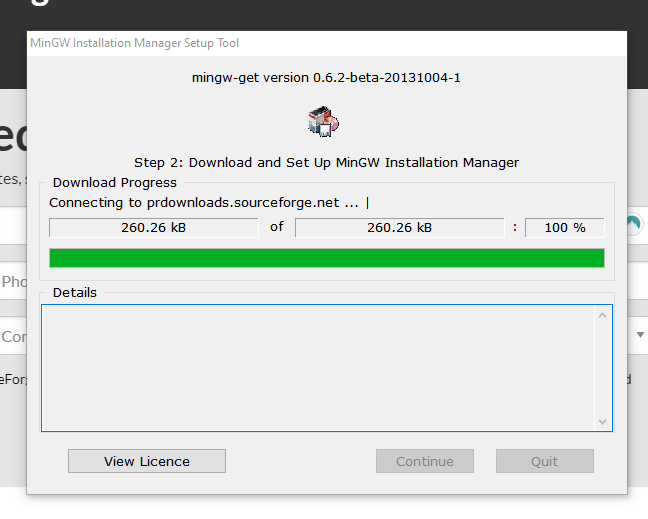
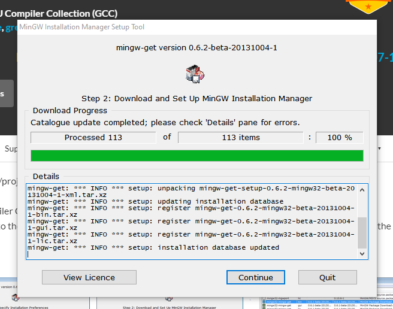
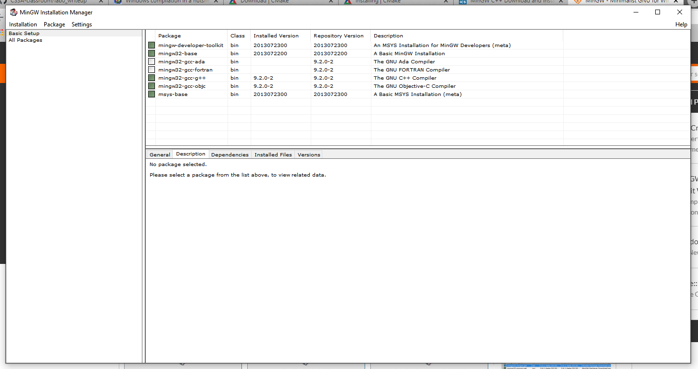
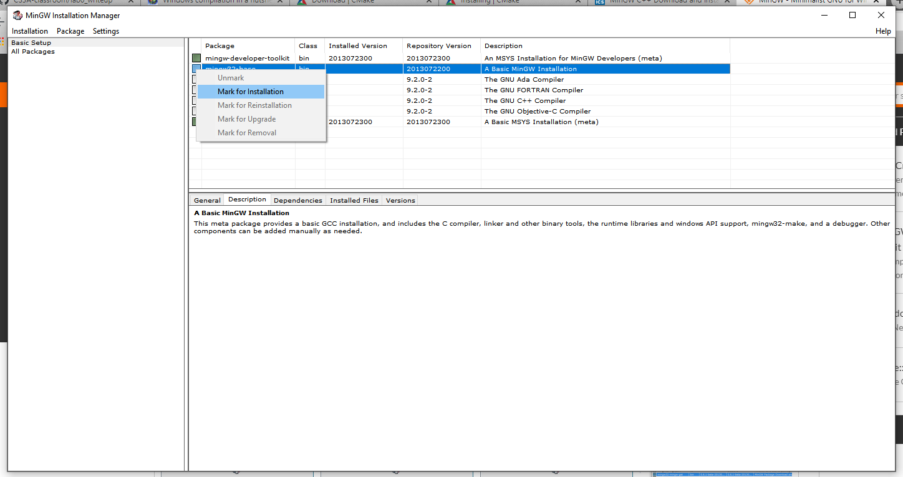
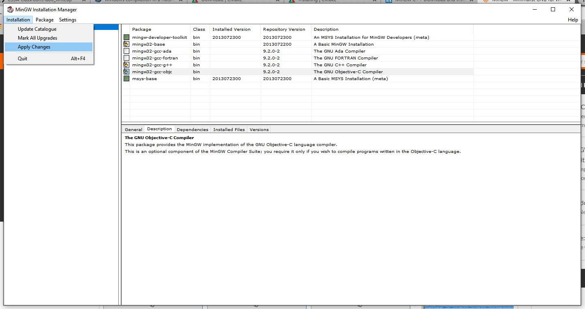
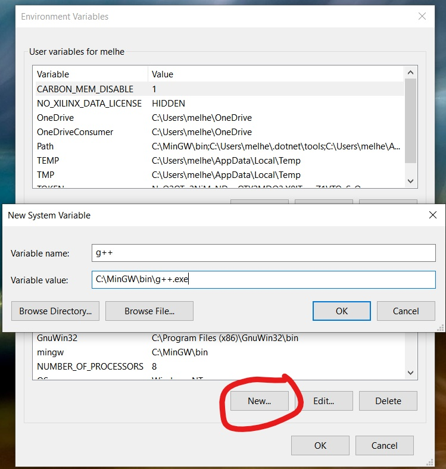
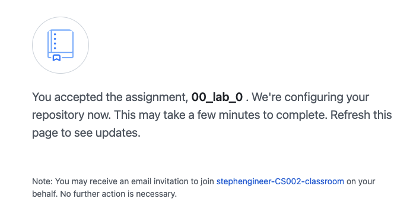
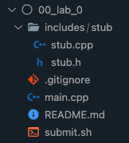

# Instructions

- ### [Mac Installing `git`](#mac_installing_git)</br>
- ### [Windows Installing `git`](#win_installing_git)</br>
- ### [Windows Installing `MinGW`](#win_installing_mingw)</br>

- ### [Accepting the assignment](#accepting_the_assignment)</br>
- ### [Cloning the assignment](#cloning_the_assignment)</br>
- ### [Project organization](#project_organization)</br>
- ### [Getting started with the project](#getting_started)</br>
- ### [Completing the project](#completing_the_project)</br>

---

</br>

<a name="mac_installing_git"></a>

## Mac Installing git

We use [homebrew](https://brew.sh/) to [install git](https://git-scm.com/download/mac).

```sh
$ brew install git
```

If you see "brew: command not found", then you need to install brew.

```sh
$ /bin/bash -c "$(curl -fsSL https://raw.githubusercontent.com/Homebrew/install/HEAD/install.sh)"

# The following two lines for Apple M1 Processor

# you can find the following command in terminal
$ echo 'eval "$(/opt/homebrew/bin/brew shellenv)"' >> /Users/YOUR_DEVICE_NAME/.zprofile

$ eval $(/opt/homebrew/bin/brew shellenv)
```

You need to install **Xcode** from App Store before you use other IDE.

### Check git installation

To make sure git is installed correctly

```sh 
$ git --version
```


</br>

### Login git

Login git with username and email address:

```sh
$ git config --global user.name "stephengineer"
$ git config --global user.email "swang03@pasadena.edu"
```

---

</br>

<a name="win_installing_git"></a>

## Windows Installing git

### Download `git`

Download git from [here](https://git-scm.com/download/win). You should get an exe similar to this: `Git-2.30.0.2-64-bit.exe`


</br>

### Install `git`

Open/Run the executable file, and follow the steps to install.

Choose Default.


</br>

Choose Git Credential Manager Core.


</br>

Select Only show new options if not selected, and click next.


Choose Let git decide.


</br>

Choose Use OpenSSH.


</br>

Choose Default (fast-forward or merge).


</br>

Choose Git Credential Manager Core


</br>

And Install!


</br>

When it is done installing, click Finish.


</br>

You may view release notes if you want.


</br>

### Check git installation

To make sure git is installed correctly

```sh 
$ git --version
```


<br/>

### Login git

Login git with username and email address:

```sh
$ git config --global user.name "stephengineer"
$ git config --global user.email swang03@pasadena.edu
```

---

</br>

<a name="win_installing_mingw"></a>

## Install MinGW

</br>

### Is `MinGW` installed?

Let's check to see if `g++` is installed on your system:

```sh
$ g++ --version
```

If you do not get a response similar to this, then you do not have `g++` and/or `MinGW` on your system and you have to install it.


</br>

### Download `MinGW`

Download cmake from [here](https://sourceforge.net/projects/mingw/files/). You should get an exe named similar to this: `mingw-get-setup.exe`

</br>

### Install `MinGW`/`g++`

Open/Run the executable file, and follow the steps to install.




</br>

The default Installation location should be `C:/MinGW`. Once again, you can add a Desktop shortcut, but it will not be necessary for this class.


</br>

If you get a warning that MinGW is already installed, you can either reinstall and continue with this walk through or choose `Run Now` and skip to the steps below with the MinGW Install Manager.


</br>

Installing...



</br>

When it is done installing, click Continue.



</br>

The **MinGW Installation Manager** should be opened up automatically. For this class, you will need mingw32-base, mingw-gcc-g++, and mingw23-gcc-objc.



</br>

To select a package for installation, right click on it in the menu and select Mark for Installation.



</br>

Marked packages will be selected like this:


</br>

You **also** need to select the pthreads package from under <br/>
All Packages -> MinGW Libraries


</br>

Once all necessary packages have been marked, go to Installations > Apply Changes to install.



</br>

Click Apply


</br>

Once the changes are applied you may close the Installation Manager.


</br>

### Add g++ as a System Variable and to your path

Search for "path" in the task bar search box. Open Edit the system environment variables.


</br>

Click on "Environment Variables..."


</br>

Add the path to the gcc and g++ executables to environment variables as shown below and press OK.



</br>

Next, double click on the **user variable** Path (in the top half of the window). A window like this should pop up:


</br>

Click New, and enter `C:\MinGW\bin` to the text box. Click OK.


</br>

Your environment and user variables should look like this after you are done:


</br>

### Check the version of the g++ again:

To make sure `MinGW`/`g++` is installed correctly, if the version output doesn't show, reboot your machine and try again.

```sh
$ g++ --version
```


---

</br>

<a name="accepting_the_assignment"></a>

### Accepting the assignment

Here is the **assignment link** for [CS2](https://github.com/stephengineer-CS002-classroom/CS2_Assignments).

### Accept assignment

1. Click on the accept assignment link.
1. Select yourself from the list with your name.
1. Click on the green button, `Accept this assignment`  to accept the assignment.


</br>

This will create a repo under your github username. The name of repo will be the name of assignment followed by your github name.

> `00_lab_0-stephengineer`

</br>

### Assignment repo

Once you accepted the assignment, github will begin to create your assignment repo and give it a few seconds, then:

1. Refresh this page to see updates.
1. Click the link of repo.




</br>

__Note__: Bookmark this page to know how to get here. We'll need to check in here soon.


---

</br>

<a name="cloning_the_assignment"></a>

### Get git link of assignment

1. Click on the green `Code` button on the mid-right.
1. Click the little clipboard and that will copy the link into your clipboard so you can paste it in the next step. 


</br>

### Clone assignment

Before you can work on your project, you will need a local copy of the assignment. This is called **clone** the repository. Open the terminal and run following command.

```sh
# create and go the the directory of projects
$ cd /Users/stephen/CS2/

# clone repo with your URL
$ git clone https://github.com/stephengineer-CS002-classroom/00_lab_0-stephengineer.git
```

---

</br>

<a name="project_organization"></a>

### Open assignment with IDE

For example, open VSCode and loads the project folder. Or in your IDE, click on open folder.

```sh
# go the project folder
$ cd 00_lab_0-stephengineer

# open VSCode
$ code .
```

</br>

### File system

All the projects in this class will follow the same file organization.

On the left panel (Explorer) you will find:

- `main.cpp`: on the root folder, this will be the most important file you finish assignment before you learn function.
- `submit.sh`: run `sh submit.sh` to submit your assignment to github to get grader.
- `README.md`: fill out it with your output and analysis.
- `.gitignore`: file for github, do NOT modify it.

**After Chapter 03**

- `includes`: contains a folder for the function your project depends on. In this starter code, you only have a `stub` folder that contains `stub.h` and `stub.cpp`. These files are `#include`d in `main.cpp`




---

</br>

<a name="getting_started"></a>

### Step 1: Find `main.cpp`

For some assignments, I will create the `basic_test` function to demonstrate the functionality of the project and for you to make sure that your code match the grader's expectations. (otherwise, your projects will not earn a score.)

You will copy this `main.cpp` and overwrite the existing _generic_ `main.cpp` in your project folder. After this, you will __NEVER__ edit the `basic_test` function.

Pay special attention to the `#include` path at the top. Your file structure has to be __exactly__ the same as the one depicted here.

<br>

**Skip step 2, 3, 4 for now, look at it after Chapter 03**


### Step 2: Create project folder (After Chapter 03)

Create a new function folder under the `includes/` folder and name this folder by instruction of assignment. This is the directory you will add your `.h` and `.cpp` files.

### Step 3: Add two project files (After Chapter 03)

Add two files in the project folder:

- `xxx.h`
- `xxx.cpp`

</br>

### Step 4: Add the function signatures (After Chapter 03)

Add these function signatures to the `xxx.h`

### Step 5: Open terminal

If you are using VSCode, you can open the terminal by pressing [`ctrl`]+[ ` ]

[`] is the key in the top left of the keyboard

Using the terminal in this way is very convenient.

</br>

### Step 6: Build project

</br>

### Step 7: Compile project

Now, we are ready to compile project by clicking on **Run** (triangle) button.

</br>

### Step 8: Push changes to Github

Run git commands to commit changes:

To open the terminal by pressing [`ctrl`]+[ ` ]

#### Mac
```sh
$ sh submit.sh

# input some comments for your current change and press enter, for example.
Comments of Submission: init changes
```

#### Windows
```sh
$ ./submit.sh

# input some comments for your current change and press enter, for example.
Comments of Submission: init changes
```

### Basic Bash Command

```sh
# display current path
$ pwd

# list all files in current folder
$ ls

# go back to one folder
$ cd ..

# go to 00_lab_0 folder
$ cd 00_lab_0
```

---

</br>

<a name="completing_the_project"></a>

## Autograder Status

You can keep track of the grading status of your project on the assignment page. A yellow dot means that the tests are still being compiled and run by the autograder. This shouldn't take more than a minute or two. You can refresh the page to update the status. A green checkmark means that all your tests have passed. A red x means that at least one test failed.

<br/>

Yellow dot: running autograder


</br>

A red x: at least one test failed


</br>

A green checkmark: all tests have passed


</br>

Click on `Details` to see test details.

